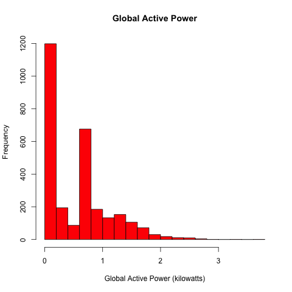
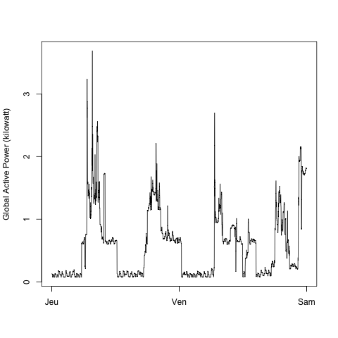
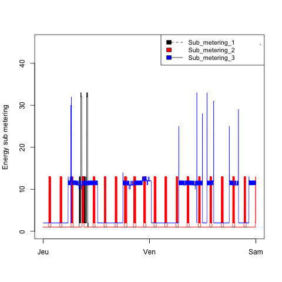
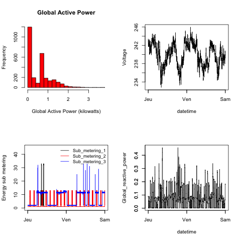

##Instructions
1. run W1Project.R. 
a. This will download the dataset from the internet, subset it to only include the two relevant dates, format the variables as specified in the instructions. IMPORTANT NOTE: Weekdays are display in French on the graphs (my native language and my operating system.)
b. The tidy dataset will then be called data. 
c. A second data.table, called tVector (for time vector) is created, and will serve to plot the x axis correctly. 
d. data and tVector are saved in W1Data, in your working directory. 
2. Run plot1.R:plot4.R. Each script begins with loading data and tVector from W1Data. 
3. Plot1.R:Plot4.R process and save hei respective plots in the /figure subdirectory.

### Plot 1

 

### Plot 2

 

### Plot 3

 

### Plot 4

 

